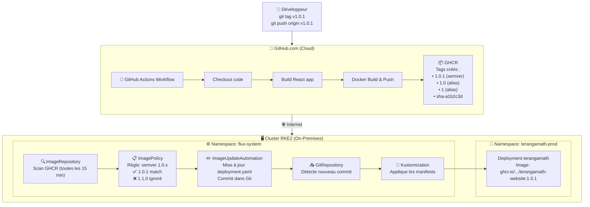
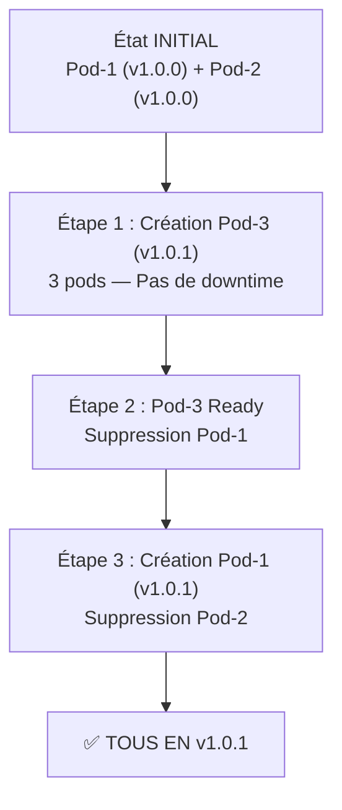
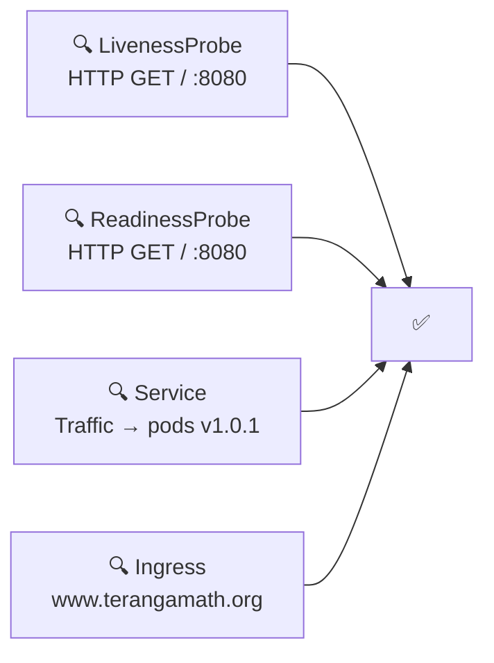

# Flux CD — Flux de Déploiement Automatique

## De Git Tag à Déploiement Kubernetes



## Rolling Update — Mise à jour progressive



## Vérifications automatiques



## Timing (Temps estimé)

| Étape | Composant | Délai |
|-------|-----------|-------|
| 1-2 | GitHub Actions | ~2-3 min |
| 3-4 | ImageRepository (scan GHCR) | ~0-15 min |
| 5 | ImageUpdateAutomation | ~1-2 min |
| 6-7 | GitRepository / Kustomize | ~1 min |
| 8-10 | Déploiement (rolling update) | ~1-2 min |
| **Total** | | **~5-18 min** (pire cas) |

## Commandes de monitoring

```bash
# Voir l'état de Flux
flux get all
flux get images all

# Voir les logs de Flux
flux logs --level=info --follow

# Voir les pods en temps réel
kubectl get pods -n terangamath-prod -w

# Voir l'historique de déploiement
git log --oneline --grep="update TerangaMath" -5

# Voir les commits de Flux dans GitHub
# https://github.com/terangamath/terangamath-website/commits/main
```

## Points clés

| Point | Détail |
|-------|--------|
| ✅ GitOps | Git = Source unique de vérité |
| ✅ Zéro downtime | Rolling update avec 2 réplicas |
| ✅ Sécurisé | Flux gère les mises à jour (pas de kubectl manuel) |
| ✅ Traçable | Chaque changement = commit Git signé "Flux Bot" |
| ✅ Automatique | Patch updates (1.0.x) sans intervention humaine |
| ⚠️ Manuel | Minor/Major updates (1.x.x) nécessitent changement de ImagePolicy |