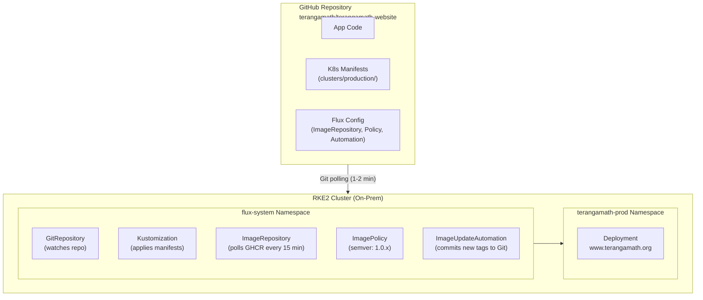
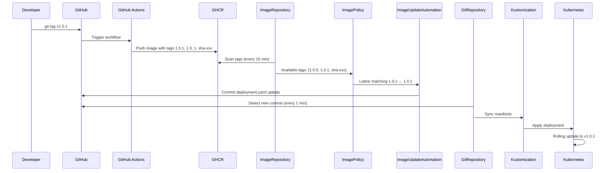

# Flux CD Setup for TerangaMath Website

This document provides a complete turnkey solution for setting up Flux CD with automatic image updates for the www.terangamath.org website on your RKE2 cluster.

## Architecture Overview



## Prerequisites

1. **Flux CLI** installed locally:
   ```bash
   curl -s https://fluxcd.io/install.sh | sudo bash
   ```

2. **kubectl** configured for your RKE2 cluster

3. **GitHub Personal Access Token (PAT)** with:
   - `repo` (full control of repositories) OR fine-grained:
     - Contents: read/write
     - Metadata: read
     - Administration: read/write (for deploy keys)

4. **Repository permissions** to create deploy keys

## Step 1: Fix Image Registry Target

Before proceeding, update `.github/workflows/deploy.yml` to push to the correct GHCR.

Ensure the `IMAGE_NAME` in the workflow is set to:
```yaml
IMAGE_NAME: terangamath/terangamath-website
```

## Step 2: Bootstrap Flux

Run this command from your local machine with kubectl pointed to your RKE2 cluster:

```bash
export GITHUB_TOKEN=<PAT>

flux bootstrap github \
  --owner=terangamath \
  --repository=terangamath-website \
  --branch=main \
  --path=clusters/production \
  --token-auth=false \
  --read-write-key \
  --components-extra=image-reflector-controller,image-automation-controller
```

**What this does:**
- Installs Flux controllers in `flux-system` namespace
- Creates SSH deploy key with read/write access to your repo
- Sets up GitRepository source to sync from `clusters/production`
- Installs image automation controllers

**Post-bootstrap:**
- Check Flux is running:
  ```bash
  kubectl get pods -n flux-system
  ```
- Check bootstrap created the sync:
  ```bash
  flux get sources git
  flux get kustomizations
  ```

## Step 3: Deploy TerangaMath Application

After bootstrap, apply the manifests:

```bash
# From repo root
kubectl apply -k clusters/production/

# Or let Flux auto-apply (after git push)
```

## Step 4: Create Git Tags for Releases

Flux image automation works with semver tags. When you want to release:

```bash
# Tag and push to trigger image build
git tag v1.0.0
git push origin v1.0.0
```

The GitHub workflow will automatically:
1. Build the image
2. Push tag `1.0.0` to GHCR
3. Flux will detect it (within 15 minutes) and update the deployment

## File Structure

```
terangamath-website/
├── .github/
│   └── workflows/
│       └── deploy.yml              # Updated for semver tags
├── clusters/
│   └── production/
│       ├── kustomization.yaml      # Root kustomization
│       ├── flux-system/            # Created by bootstrap
│       │   ├── gotk-components.yaml
│       │   ├── gotk-sync.yaml
│       │   └── kustomization.yaml
│       └── terangamath/
│           ├── kustomization.yaml  # App kustomization (no namespace override)
│           ├── namespace.yaml
│           ├── deployment.yaml     # With Flux image marker
│           ├── service.yaml
│           ├── ingress.yaml
│           ├── networkpolicy.yaml
│           ├── image-repository.yaml   # namespace: flux-system
│           ├── image-policy.yaml       # namespace: flux-system
│           └── image-update-automation.yaml  # namespace: flux-system
├── src/                           # React application
├── public/
├── Dockerfile
└── ...
```

## How It Works

### Automatic Deployment Flow



### Typical Lead Times

| Step | Max Delay |
|------|-----------|
| Image push → ImageRepository scan | 15 minutes |
| Image detected → Git commit | 2 minutes |
| Git commit → Cluster apply | 1 minute |
| **Total worst case** | **~18 minutes** |

With webhook (optional): near-instant notification

### Version Strategy

- **ImagePolicy range:** `1.0.x` (patch-only auto-updates)
- **Manual minor bumps:** Update policy to `1.1.x` when ready
- **Starting version:** `1.0.0` (set in deployment.yaml initially)

## Manual Operations

### Force immediate sync
```bash
flux reconcile kustomization terangamath -n flux-system --with-source
```

### Check image automation status
```bash
flux get images all
```

### View automation commits
```bash
flux logs --level=info --flux-namespace=flux-system
```

### Rollback to previous version
```bash
# Revert the Flux commit in Git
git revert <flux-automation-commit>
git push
```

## Troubleshooting

### Image not updating
```bash
# Check ImageRepository status
flux get image repository terangamath

# Check available tags
kubectl -n flux-system describe imagerepositories.image.toolkit.fluxcd.io terangamath

# Check ImagePolicy
flux get image policy terangamath
```

### Git sync issues
```bash
# Check GitRepository status
flux get source git flux-system

# Check Kustomization
flux get kustomization terangamath
```

### Manual trigger
```bash
# Reconcile image repository
flux reconcile image repository terangamath -n flux-system

# Reconcile update automation
flux reconcile image update terangamath -n flux-system
```

## Security Considerations

1. **SSH Deploy Key:** Flux uses SSH key (not PAT) for ongoing Git operations
2. **No cluster exposure:** On-prem cluster doesn't need internet exposure
3. **Read-only GHCR:** ImageRepository only needs `read:packages` scope if private
4. **Git commits:** All changes are tracked in Git history
5. **No manual kubectl:** Flux manages deployment; manual kubectl discouraged

## Important Notes

### Kustomization Namespace Handling

The `clusters/production/terangamath/kustomization.yaml` deliberately does **not** include a `namespace:` override. This is because:

- App resources (Deployment, Service, Ingress, NetworkPolicy) have `namespace: terangamath-prod` set explicitly in their YAML
- Flux CRDs (ImageRepository, ImagePolicy, ImageUpdateAutomation) have `namespace: flux-system` set explicitly in their YAML
- A kustomization-level `namespace:` override would incorrectly move Flux CRDs to `terangamath-prod`, breaking the automation

## Documentation Links

- [Flux Getting Started](https://fluxcd.io/flux/get-started/)
- [Flux Image Automation](https://fluxcd.io/flux/guides/image-update/)
- [GitHub Container Registry](https://docs.github.com/en/packages/working-with-a-github-packages-registry/working-with-the-container-registry)
- [Flux CLI Reference](https://fluxcd.io/flux/cmd/)

## Next Steps

1. ✅ Bootstrap Flux on RKE2
2. ✅ Push manifests to `clusters/production/`
3. ✅ Create initial Git tag `v1.0.0`
4. ✅ Verify deployment updates automatically
5. (Optional) Set up webhook for faster notifications
6. (Optional) Add SOPS for secret encryption in Git